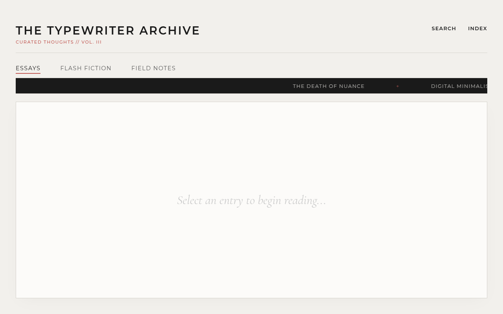

# The Typewriter Archive

A typewriter-themed blog archive — essays on interfaces, latency, and typography ("The Binary Trap", "Reclaiming Ambiguity", "The Noise Floor", "The Case for Latency", ...).

**Live:** https://mvvk-space.github.io/marquee-blog/

